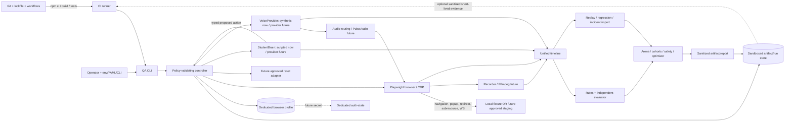

# QA Lab — Authoritative System Threat Model

**Scope:** Phase 0–10 local deterministic framework and separately gated future staging execution

**Authority:** This is the system security threat model. Product intent remains governed by [`QA_LAB_PRODUCT_STRATEGY.md`](QA_LAB_PRODUCT_STRATEGY.md), delivery order by [`ROADMAP.md`](ROADMAP.md), and capability truth by [`CAPABILITY_GAP_MAP.md`](CAPABILITY_GAP_MAP.md).

**Last reviewed:** 2026-07-14

## 1. Security objective and scope truth

QA Lab is an independent, browser-oriented evaluation controller. Its framework capability is local deterministic fixtures using scripted brains, synthetic personas/WAV, provider-free replay, and redacted local artifacts. Separately authorized Gia Su AI staging modules now have bounded public/auth/catalog/reset/guided-self-study evidence. This does not authorize production, deployment, real child data without completed policy gates, autonomous repair, or model access to shell/source/Git/cloud.

This model covers build-time inputs and CI as well as runtime execution. A passing contract fixture proves that a policy/schema/algorithm behaves on synthetic inputs; it does **not** prove that a real tutor resisted red-team attacks, that a provider is safe, or that staging is accepted.

## 2. Assets and data classes

| Class | Examples | Sensitivity / required treatment |
|---|---|---|
| Security policy | Exact-host allowlist, fixture-mode gate, action allowlists, reset policy, rubric blocker precedence | Integrity-critical; reviewed and fail-closed |
| Code/build inputs | Source, lockfile, npm packages, Playwright browser binary, workflow, scenarios, prompts, rubrics | Integrity-critical; untrusted until review, install/build/test |
| Authentication material (future) | Dedicated test credentials, cookies, tokens, browser profile/auth state, reset authorization | Secret; never committed or logged; least privilege; isolated and revocable |
| Provider secrets (future) | Brain/voice/evaluator API keys | Secret; CI/runtime secret store only after approval; never frontend/artifact |
| Synthetic fixtures | Personas, scripted transcripts, synthetic WAV, local fixture pages | Non-production test data, but still integrity-relevant and must not be confused with real evidence |
| Child/PII data | Name, contact details, parent details, raw child image/audio/transcript, identifiers | Prohibited today; future use requires explicit policy, minimization, consent/legal basis, retention/deletion controls |
| Run evidence | Timeline, screenshots, transcript, console/network logs, evaluation, replay digest, arena/cohort/safety/optimizer reports | Potentially sensitive; redact, sandbox, no overwrite, provenance and retention |
| Recordings | `session.mp4`, audio, screenshots/checkpoints | High sensitivity; opt-in, truthful capability state, shortest retention; raw child recordings prohibited today |
| Evaluation truth | Deterministic blockers, rubric/version, evaluator identity, scores, issue fingerprints, baseline/candidate hashes | Integrity-critical; evaluator cannot override deterministic blockers or self-certify |
| Host resources | Operator workstation, filesystem, browser profile, CPU/RAM/disk, audio devices, local ports | Must be isolated from unrelated repositories/data and protected against exhaustion |
| Staging service (future) | Approved exact host, dedicated account/data, reset endpoint, WebSocket/API traffic | External untrusted boundary; never production; authorization required per task |

## 3. Actors and trust assumptions

| Actor | Trust assumption and limit |
|---|---|
| Founder/operator | Authorizes product intent and future staging/data use; may make configuration mistakes, so schema and policy still validate inputs |
| Developer/reviewer | Trusted to review scoped changes, but commits/dependencies/workflows are untrusted until independently validated |
| CI runner | Ephemeral but not a secret boundary against malicious repository code; receives no staging/production secrets and uses read-only repository permission |
| QA Controller/CLI | Trusted policy enforcement point only when built from reviewed source and lockfile; validates all external/model inputs |
| Browser/page/service worker | Untrusted content, including redirects, popups, frames, subresources, downloads, and WebSockets |
| StudentBrain/VoiceProvider/evaluator (future) | Untrusted probabilistic providers; output is data, never authority or executable instruction |
| Scripted/mock adapters | Deterministic test components, not evidence of provider or real-tutor behavior |
| Synthetic persona | Test input that may contain adversarial strings; never grants capabilities |
| Local OS user/process | Same-user processes may alter readable artifacts/profile or bind ports; local machine is not assumed hostile-multi-tenant-safe |
| Package/browser/action publisher | Supply-chain actor; package tarballs, lifecycle scripts, Playwright browser downloads, and Actions revisions can be compromised |
| Attacker | Malicious page, fixture, dependency, pull request, provider response, artifact/import bundle, or local process attempting exfiltration, tampering, spoofing, or DoS |

## 4. Build-time versus runtime

**Build-time:** Git checkout, review, `npm ci`, npm lifecycle behavior, lockfile resolution, TypeScript/ESLint/tests, Playwright Chromium installation, workflow execution, secret scanning, and artifact publication. Build-time code can execute with runner permissions; therefore CI has `contents: read`, no environment secrets, no staging configuration, and no deployment permission.

**Runtime:** CLI/config parsing, run creation, controller decisions, browser/profile/auth-state, page/network/CDP, future reset, StudentBrain/VoiceProvider/evaluator calls, audio routing/recording, timeline/replay/import, reports, and cleanup. Runtime authorization is not inherited from build success: every URL, action, path, schema version, and provider result is revalidated.

## 5. Trust boundaries and data flow

Boundary rules:

1. Environment, YAML, CLI arguments, scenarios, personas, prompts, rubrics, imports, and model output are untrusted until strict versioned validation.
2. The controller, not a model, owns authorization. Proposed actions must match the narrow typed allowlist before browser execution.
3. Browser content is hostile. Authorization is checked for initial navigation and every redirect, popup/new page, frame/subresource request, and WebSocket.
4. Dedicated profiles/auth state must not be shared with personal or production browsing. Future reset is a separate privileged operation requiring explicit approved contract and confirmation.
5. Artifact/import paths stay beneath the configured root, do not overwrite, and must resist symlink/reparse/junction escape.
6. Evaluator output is advisory beneath deterministic blockers; a brain/model cannot be its sole judge.
7. CI is fixture-only and must never resolve staging/production configuration or receive runtime/provider credentials.

## 6. STRIDE threat analysis and controls

### 6.1 Spoofing

| Threat | Existing control / source | Residual risk |
|---|---|---|
| Production or look-alike host presented as staging | HTTPS/WSS, default port, no URL credentials, normalized exact-host equality in `src/security.ts` and `src/browser-policy.ts`; negative tests in `test/security.test.ts` and `test/browser-policy.test.ts` | DNS/CA compromise and an incorrectly approved hostname remain; approval is limited to exact `giasu-c2165.web.app` modules |
| Loopback fixture confused with staging | Explicit fixture mode and exact ephemeral loopback port in `src/browser-policy.ts`; browser policy tests | A compromised local process may race/bind a local port; fixture evidence remains non-staging evidence |
| Provider/evaluator identity spoofed | Versioned identities/config hashes and provenance in `src/model-arena.ts`, `src/education-eval.ts`, and `src/quality-optimizer.ts` | Real provider attestation and signed responses are not implemented |
| Auth/account confusion | Dedicated staging test account, verified identity hash, private untracked profile and explicit account controls | MFA/revocation automation and encrypted portable auth-state are not implemented; the profile remains host-local and operator-controlled |

### 6.2 Tampering

| Threat | Existing control / source | Residual risk |
|---|---|---|
| Config/scenario/rubric schema drift | Strict schema versions and unknown-key rejection in `src/config.ts`, `src/student-contracts.ts`, `src/web-scenario.ts`, `src/education-eval.ts`; corresponding tests | Authorized maintainers can still change policy; review/branch protection is external |
| Artifact overwrite, run collision, path traversal | Safe single-segment IDs, root resolution, exclusive directory/file creation in `src/run-store.ts`; tests in `test/run-store.test.ts` and `test/security.test.ts` | Windows reparse/junction and race hardening is partial; local same-user tampering is not cryptographically detectable |
| Timeline/replay reorder or mutation | Monotonic sequence/timestamp/schema validation and deterministic digest in `src/event-timeline.ts` and `src/replay-engine.ts`; `test/replay-regression.test.ts` | No signed manifest, immutable store, trusted timestamp, or chain of custody |
| Malicious incident/import archive escapes root | Validated run selectors and anonymized packaging in `src/regression.ts` and `src/incident-regression.ts` | Generic hostile archive ingestion is not implemented; future importer must reject absolute paths, `..`, links, devices, and decompression bombs |
| Evaluator/rubric poisoning | Deterministic hard blockers take precedence; scripted evaluator is separate; arena records independent evaluator identity in `src/education-eval.ts` and `src/model-arena.ts` | Real evaluator calibration, prompt integrity signing, and anti-collusion are not implemented |

### 6.3 Repudiation

| Threat | Existing control / source | Residual risk |
|---|---|---|
| Runner/model denies action or result | Unified versioned timeline, evidence references, hashes/provenance, status and report artifacts in `src/event-timeline.ts`, `src/student-qa.ts`, `src/web-qa.ts`, `src/model-arena.ts` | Local logs can be deleted/edited; no signatures, external append-only audit, or trusted clock |
| False PASS when capability unavailable | Missing target/reset/integration yields `BLOCKED`; recording probe blocks without FFmpeg in `scripts/recording-fixture-e2e.ts`; status semantics in `src/education-eval.ts` | Scripts/workflows must preserve exit contracts; operator can misreport outside repository evidence |

### 6.4 Information disclosure

| Threat | Existing control / source | Residual risk |
|---|---|---|
| Secrets in structured/nested logs | Recursive sensitive-key and token-like redaction in `src/redaction.ts` and `src/logger.ts`; `test/redaction-logger.test.ts` | Novel encodings/secret formats may evade detection; redaction is not permission to ingest secrets |
| Cookies/tokens exposed through browser logs, screenshots, profile, reports | Dedicated profile boundary, request filtering, recursive artifact redaction; governance forbids committing credentials | Profile-at-rest encryption, screenshot OCR redaction, secure deletion, and future auth-state handling are not implemented |
| Raw child PII/audio/image/transcript retained | Real child data prohibited; incident packaging rejects raw child identity/audio/image/transcript fields in `src/incident-regression.ts`; synthetic-only fixtures | A real staging page could render PII into screenshots/DOM; approved data policy and minimization gate are absent |
| CI artifact leakage | Current intended CI is fixture-only and should avoid uploads unless sanitized; no secrets supplied | Fork/PR logs and third-party Actions remain disclosure surfaces; sanitization is pattern-based |

### 6.5 Denial of service

| Threat | Existing control / source | Residual risk |
|---|---|---|
| Infinite browser/model loop, hung navigation, turn explosion | Bounded scenarios/actions/turns/timeouts in `src/browser-controller.ts`, `src/web-qa.ts`, `src/student-qa.ts`; serialized tests | Provider latency/billing limits and global run budget are not accepted for real providers |
| Disk exhaustion from screenshots/video/timelines/imports | No-overwrite store, recorder disk guard/retention/cleanup in `src/recorder.ts`; PASS video early deletion | Aggregate quota, free-space reservation, log rotation, and archive-bomb defenses are partial/not implemented |
| CPU/RAM/process exhaustion by Chromium, FFmpeg, replay, cohorts | Bounded fixture sizes and serial tests; recorder cleanup | OS-level cgroups/job objects, process-tree kill guarantees, and concurrency quotas are not implemented |
| Network flood via page subresources/WebSockets | Exact-host protocol policy in `src/browser-policy.ts` | Same-host abusive endpoints, large responses, WebSocket message volume, service workers, and downloads need explicit quotas |

### 6.6 Elevation of privilege

| Threat | Existing control / source | Residual risk |
|---|---|---|
| Prompt injection asks model to use shell/Git/cloud/payment/arbitrary domain | Typed structured action allowlist and policy-first denial in `src/student-brain.ts`, `src/student-qa.ts`, and `src/safety-lab.ts`; `test/phase10.test.ts` | Phase 10 is contract-fixture evidence only; real multimodal tutor/provider red-team is not implemented |
| Web text/image metadata/subresource injects instructions | Safety fixture covers student/web/image-metadata-placeholder sources in `src/safety-lab.ts`; browser actions still validated by controller | OCR/EXIF/file parsing and real multimodal provider behavior are untested |
| Public CDP/noVNC allows browser takeover | Current controller launches locally through Playwright; strategy requires local bind/SSH tunnel for future remote use | Remote CDP/noVNC deployment is not implemented or accepted; browser sandbox/host hardening needs a separate review |
| Audio routing exposes host microphone or creates monitor loop | Voice opt-in defaults off; isolated student/tutor sinks and forbidden cross-monitor loops in `src/audio-routing.ts`; tests in `test/audio-routing.test.ts` | Windows native route is blocked; Linux host device ACLs and PulseAudio/PipeWire policy require acceptance |

## 7. Platform-specific threats

### Windows

- NTFS junctions, symlinks, mount points, and other reparse points can make a lexically safe artifact path escape its root. Current resolved-parent/safe-segment checks are **partial**. Before hostile roots/imports, walk each existing path component without following reparse points, reject reparse tags, create roots in a trusted operator-owned directory, and revalidate handles after creation.
- ACL inheritance may expose profiles/artifacts to other local users. Future auth-state requires a private operator ACL and explicit deletion procedure.
- Process termination may leave Chromium/FFmpeg descendants or locked profiles. Cleanup must verify the process tree and mark partial cleanup truthfully.
- FFmpeg is absent on the audited host; recording must remain expected `BLOCKED` and must not fabricate `session.mp4`.

### Linux

- Artifact/profile directories require private ownership and restrictive permissions (directory `0700`, secret files `0600` where applicable); reject group/world-writable roots for future secret-bearing runs.
- CDP/noVNC/PulseAudio sockets must never bind publicly. If later authorized, bind loopback and access through an authenticated encrypted tunnel; firewall and verify effective listeners.
- PulseAudio/PipeWire sink/source names and monitors are untrusted host state. `scripts/setup-linux-audio.sh` is explicit, idempotent, and refuses unsafe echo state; it is never auto-run. Validate least-privilege audio group/device access and no physical-microphone capture.
- Container/root execution can broaden filesystem/device reach. Do not run browsers/providers privileged; pin user namespaces/sandbox policy during a separate Linux acceptance.

## 8. Browser and network abuse cases

- **Popup/new page:** deny or close unless its complete URL independently passes policy; do not inherit opener authorization.
- **Redirect/meta refresh/history/navigation:** validate every request/navigation, including scheme, credentials, port, and exact hostname; fail closed before data submission.
- **Frames/subresources/service workers/downloads:** apply protocol/host rules to documents, scripts, images, fonts, fetch/XHR, workers, and downloads. Downloads are untrusted artifacts and are not currently an accepted capability.
- **WebSocket:** require `wss:` and exact approved hostname (or explicit exact-port loopback fixture); do not treat an approved page as approval for arbitrary socket endpoints.
- **Same-host abuse:** allowlisting does not make content benign. Bound response sizes/time, redact headers/payloads, and prevent page-controlled filesystem paths.
- **TLS/CDP:** ignore-certificate-errors and public remote-debugging are forbidden for staging acceptance.

## 9. AI, prompt-injection, and evaluator threats

All student text, tutor output, page content, image metadata/OCR text, transcript, and provider metadata are data. They cannot expand tools or policy. Models receive bounded context and produce versioned typed decisions. Unknown actions/fields/versions fail closed.

The Safety Lab currently validates safely phrased **contract fixtures** for eight policy categories and controller denial. It does not attack a real tutor, ingest adversarial images, call a live model, or prove jailbreak resistance. A real red-team requires separate authorization, approved safe corpus, provider/data review, bounded target, independent evaluator/human escalation, and evidence handling.

Self-judging and poisoning controls:

- deterministic functional/safety blockers override aggregate or LLM scores;
- StudentBrain is not the sole final judge;
- evaluator identity/config/rubric/evidence versions are recorded;
- incompatible evidence versions and hard blockers prevent ranking;
- unknown cost/quality/latency is not coerced to zero/pass;
- real evaluator calibration, adversarial rubric tests, evaluator diversity, and human review thresholds remain gates.

## 10. Artifact, replay, retention, and deletion

- Validate run IDs and relative selectors; reject absolute paths, `..`, backslashes/alternate separators where disallowed, overwrite, links, special files, and root escape.
- Timeline/import validation rejects unknown schema versions, corrupt JSONL, non-monotonic sequence/time, and incompatible evidence. Replay is provider-free and cannot execute instructions embedded in transcript events.
- Artifacts are evidence, not trusted commands. Markdown/HTML reports must escape active content before future web rendering.
- Current fixtures contain synthetic data. PASS video is deleted early by default; FAIL/release retention exists in recorder policy, but no organization-wide durations are approved.
- Before staging: define exact retention periods by class, owner/legal basis, encrypted storage, access audit, deletion SLA, backup deletion, and verification. Raw child audio/images/transcripts remain prohibited until then.
- Deletion must include profile/auth-state, temporary audio/video, partial recordings, extracted imports, CI artifacts, caches, and provider-side copies under contract. Record deletion outcome without retaining the deleted sensitive value.

## 11. Supply-chain and CI threats

- `package-lock.json` plus `npm ci` constrains npm resolution, but does not guarantee package safety. Review lockfile diffs, run audit/secret checks, minimize dependencies, and consider disabling lifecycle scripts only after confirming Playwright/package requirements.
- Playwright Chromium is a downloaded executable. Pin Playwright through lockfile, install only Chromium deterministically, and treat browser cache provenance as build evidence; upstream compromise remains residual.
- GitHub Actions can execute repository code. Use repository-owned scripts where possible, pin third-party Actions to reviewed immutable commit SHAs, grant only `contents: read`, cancel superseded runs, expose no staging/production secrets, and never deploy.
- Pull-request code must be assumed malicious; do not use privileged `pull_request_target`, persistent self-hosted runners, cloud credentials, auth-state, or secret-bearing artifact uploads.
- Secret scanning must remain local to the runner and scan tracked files. Allow only explicit test placeholders; do not upload source to an external scanner.
- `npm audit` is advisory evidence: false positives and registry availability do not replace review, and an unavailable registry must be reported truthfully.

## 12. Status matrix

| Security capability | Status | Evidence / gap |
|---|---|---|
| Strict config/version validation | Implemented | `src/config.ts` and contract loaders/tests |
| Exact-host HTTPS/WSS and explicit fixture policy | Implemented | `src/security.ts`, `src/browser-policy.ts`, tests |
| Redirect/subresource/WebSocket enforcement | Implemented and bounded-staging validated | `src/browser-policy.ts`, browser integration tests and approved staging runs; same-host response-size/service-worker/download risks remain |
| Typed model action boundary | Implemented at scripted scope | `src/student-brain.ts`, `src/student-qa.ts`, Phase 10 policy fixture |
| Safe artifact IDs/no-overwrite/root containment | Implemented | `src/run-store.ts`, replay selectors, tests |
| Junction/reparse/symlink hostile-root defense | Partial | Lexical/resolved containment exists; component/handle-level defense absent |
| Recursive secret redaction | Implemented, defense in depth | `src/redaction.ts`, logger/artifact tests |
| Dedicated browser profile | Implemented; bounded staging accepted | `src/browser-controller.ts`; private host-local profile is accepted for the synthetic staging account, but portable/encrypted profile distribution is not |
| Auth-state and dedicated staging account lifecycle | Bounded staging accepted | Private host-local profile, verified identity and fresh-process persistence exist; portable encrypted storage/MFA/revocation automation remain absent |
| Reset integration | Implemented for declared scopes | Exact-host, identity/lesson-bound, token-from-env, idempotent scopes exist for session-start and guided self-study; arbitrary reset scopes remain forbidden |
| FFmpeg real recording | Not implemented on current host / blocked | Recorder foundation exists; FFmpeg absent; no fake video |
| Native Linux voice/PulseAudio route | Partial / blocked on Windows | Contracts/setup/probe exist; Linux acceptance absent |
| Real Brain/Voice/Evaluator providers | Not implemented | Scripted/mock/synthetic only; no keys/provider calls |
| Real tutor multimodal red-team | Not implemented | Safety contract fixture only |
| Timeline/replay/regression integrity validation | Implemented locally | No cryptographic signing/immutable store |
| Arena/cohort/safety/optimizer policy foundations | Implemented as deterministic fixtures | Not provider benchmark, real red-team, or deployment optimization |
| Child-data privacy/retention program | Not implemented | Real child data prohibited |
| CI independent validation | Not implemented at this threat-model revision | Separate QA-CI-002 task; remote evidence must be reported only after GitHub run |
| Production/deployment | Forbidden | No capability or authorization |

## 13. Future staging readiness security gates

All gates must pass before any staging execution; none authorizes production:

1. Written authorization for one normalized HTTPS staging hostname and confirmation it cannot route to production.
2. Dedicated least-privilege synthetic test account, verified environment marker, no real child data, documented owner/revocation/MFA policy.
3. Approved auth-state encryption/storage/expiry/deletion and isolated browser profile.
4. Approved idempotent reset contract, scoped data namespace, confirmation/anti-production guard, audit evidence, and failure-to-`BLOCKED` behavior.
5. Browser tests for popup, redirect, frame, subresource, service worker, download, and WebSocket denial; TLS validation remains enabled.
6. Egress policy for provider endpoints, secrets in a managed store, key scope/quotas, provider privacy/DPA review, and zero secret in artifact/log.
7. Child-data DPIA/policy where applicable: synthetic-by-default, consent/legal basis, minimization, residency, access, retention, deletion, incident notification.
8. Linux host hardening if used: private permissions, local-only CDP/noVNC/audio, non-root browser, patched OS, resource quotas.
9. FFmpeg/audio acceptance separately proves process cleanup, no unintended microphone, route isolation, disk guard, retention, and truthful blocked/failure paths.
10. Independent evaluator calibration and adversarial tests; deterministic blockers cannot be overridden.
11. Signed/hashed run manifest or protected evidence store for release decisions; import provenance and tamper detection.
12. CI is green on reviewed commit, but contains no staging job/secrets. Staging remains a manually authorized, separate workflow/task with no deployment.

## 14. Incident response, key rotation, and deletion

1. **Contain:** stop runs, disable future staging/provider flags, revoke test sessions, isolate affected profile/artifacts, and preserve minimal read-only evidence.
2. **Classify:** determine secret/PII/child-data exposure, target host, run IDs, provider, time window, commits/dependencies, and whether evidence integrity is compromised.
3. **Rotate:** revoke and replace affected account sessions, API keys, cookies/tokens, SSH/tunnel credentials, and CI credentials; do not merely edit logs. Validate old credentials are unusable.
4. **Eradicate:** remove malicious dependency/input, patch policy, invalidate poisoned baselines/reports, and add deterministic regression tests.
5. **Delete:** execute approved deletion across local runs, profiles, temp files, CI artifacts/caches, backups, and provider stores; document verification and exceptions without reproducing secrets/PII.
6. **Recover:** rerun offline/local gates first, then obtain explicit authorization before bounded staging retest. Never use production to validate recovery.
7. **Notify/review:** follow legal/provider/child-safety escalation deadlines, preserve chain-of-custody metadata, publish a blameless root cause, and rotate keys again if containment certainty is low.

No current committed key is expected. Discovery of a committed secret requires immediate revocation even if later removed from Git; history cleanup is a coordinated incident action, never an unapproved force push.

## 15. Verification mapping

| Control objective | Tests / command evidence |
|---|---|
| Config, host, URL credential, scheme/port, run-path validation | `test/config.test.ts`, `test/security.test.ts`, `test/browser-policy.test.ts`, `test/run-store.test.ts` |
| Browser popup/redirect/subresource/WebSocket and cleanup policy | `test/browser-controller.integration.test.ts`, `test/browser-policy.test.ts`, `test/web-qa-failures.test.ts` |
| Redaction and sensitive artifact handling | `test/redaction-logger.test.ts`, `test/replay-regression.test.ts`, `test/phase10.test.ts` |
| Student action allowlist/bounded context/reset blocking | `test/student-brain.test.ts`, `test/student-contracts.test.ts`, `test/student-qa.test.ts` |
| Voice isolation and provider-free synthetic WAV | `test/audio-routing.test.ts`, `test/voice-provider.test.ts`, `npm run qa:voice:fixture` |
| Recording truthful capability and cleanup | `test/recorder.test.ts`, `npm run qa:recording:fixture` (expected `BLOCKED` when FFmpeg missing; no `session.mp4`) |
| Evaluator precedence/self-judge separation | `test/education-eval.test.ts`, `test/model-arena-cohorts.test.ts` |
| Timeline/replay/import traversal/tamper failure | `test/replay-regression.test.ts`, `npm run qa:replay:fixture`, `npm run qa:regression:fixture` |
| Safety contract and optimizer unknown/blocker handling | `test/phase10.test.ts`, `npm run qa:phase10:fixture` |
| Full local gate | `npm run lint`, `npm test`, `npm run build`, `npm run qa:status`, `npm run qa:doctor` |
| CI/supply-chain gate | QA-CI-002 workflow: `npm ci`, pinned Node LTS, Chromium install, full tests/fixtures, audit, repository-owned secret scan, separate recording expected-blocked contract |

Security tests include positive and negative boundaries, but fixture success must always be labeled local deterministic evidence. Real staging, real providers, physical audio, FFmpeg recording, and real red-team require separate acceptance evidence and must never be inferred from this matrix.

## 16. Accepted and residual risks

Accepted for the current local deterministic scope:

- same-user local filesystem access can read or alter artifacts; artifacts are not cryptographically signed;
- redaction may miss novel/encoded secrets, so sensitive input remains prohibited;
- Windows reparse-point hardening is incomplete, so artifact roots/imports must be trusted and local;
- FFmpeg and native Linux audio capability remain blocked/unaccepted;
- npm/Playwright/GitHub supply-chain compromise cannot be eliminated, only constrained and reviewed;
- synthetic evaluators and Safety contract fixtures are not human-calibrated real-provider assurance;
- resource limits are bounded in scenarios/tests but not OS-enforced globally;
- no approved organization-wide retention schedule, encrypted evidence service, portable auth-state service, or real-child data program exists; current staging auth/reset is host-local and limited to declared synthetic-account scopes.

These risks are accepted for local credential-free fixtures and for the separately authorized, host-local synthetic-account staging modules recorded above. Production remains prohibited. Any expansion of target, provider, data class, host, reset scope, recording, import source, or CI privilege reopens this threat model and requires explicit acceptance evidence.
